# 🚀 User Management System

> Une application moderne de gestion d'utilisateurs construite avec Angular 20, Bootstrap 5, et une architecture professionnelle basée sur les Signals.

[](https://angular.io/)
[](https://www.typescriptlang.org/)
[](https://getbootstrap.com/)
[](LICENSE)

## 📋 Table des matières

- [✨ Fonctionnalités](#-fonctionnalités)
- [🛠️ Technologies](#️-technologies)
- [🏗️ Architecture](#️-architecture)
- [⚡ Installation rapide](#-installation-rapide)
- [📖 Guide d'utilisation](#-guide-dutilisation)
- [� Screenshots](#-screenshots)
- [�🔧 Configuration](#-configuration)
- [📁 Structure du projet](#-structure-du-projet)
- [🎨 Design et UX](#-design-et-ux)
- [📊 API](#-api)
- [🧪 Tests](#-tests)
- [🚀 Déploiement](#-déploiement)
- [🤝 Contribution](#-contribution)

## ✨ Fonctionnalités

### 🎯 Fonctionnalités principales
- **Gestion complète des utilisateurs** : Ajouter, modifier, supprimer, visualiser
- **Recherche et filtres avancés** : Recherche par nom/email, filtrage par genre
- **Statistiques en temps réel** : Compteurs automatiques avec animations
- **Export multi-format** : Excel (.xlsx), CSV, JSON
- **Interface responsive** : Adaptation mobile et tablette
- **Notifications intelligentes** : Feedback utilisateur en temps réel

### 🎨 Design moderne
- **Interface professionnelle** : Design épuré et moderne
- **Animations fluides** : Transitions et effets visuels
- **Palette de couleurs cohérente** : Thème professionnel
- **Icônes Bootstrap** : Interface intuitive
- **Responsive design** : Compatible tous écrans

### ⚡ Performance
- **Architecture Signals** : Réactivité optimale
- **Lazy loading** : Chargement à la demande
- **Optimisation bundle** : Code splitting automatique
- **State management** : Gestion d'état centralisée

## 🛠️ Technologies

### Frontend
- **Angular 20** - Framework principal
- **TypeScript 5.8** - Langage de développement
- **Bootstrap 5.3** - Framework CSS
- **Bootstrap Icons** - Icônes
- **SCSS** - Préprocesseur CSS
- **RxJS 7.8** - Programmation réactive

### Backend (Mock)
- **JSON Server** - API REST simulée
- **Node.js** - Environnement d'exécution

### Outils de développement
- **Angular CLI 20** - Outils de développement
- **Webpack** - Bundler
- **TypeScript Compiler** - Compilation
- **ESLint** - Analyse de code
- **Karma/Jasmine** - Tests unitaires

### Bibliothèques spécialisées
- **XLSX** - Export Excel
- **Concurrently** - Exécution parallèle des serveurs

### 🏛️ Principes SOLID
- **S**ingle Responsibility : Chaque classe a une responsabilité unique
- **O**pen/Closed : Extension sans modification
- **L**iskov Substitution : Substitution des interfaces
- **I**nterface Segregation : Interfaces spécialisées
- **D**ependency Inversion : Injection de dépendances

## ⚡ Installation rapide

### Prérequis
- Node.js 18+ 
- npm 9+
- Angular CLI 20+

### 🚀 Installation en 3 étapes

```bash
# 1. Cloner le projet
git clone https://github.com/OTH-BD/AngularUserManagementSys.git
cd AngularUserManagementSys

# 2. Installer les dépendances
npm install

# 3. Lancer l'application
npm run dev
```

L'application sera accessible sur :
- **Frontend** : http://localhost:4201
- **API** : http://localhost:3002

## 📖 Guide d'utilisation

### 🎛️ Interface utilisateur

#### 📊 Tableau de bord
- **Statistiques** : Affichage en temps réel des métriques utilisateurs
- **Cartes animées** : Effets de survol et transitions fluides
- **Données dynamiques** : Mise à jour automatique

#### 👥 Gestion des utilisateurs
- **Ajout** : Formulaire avec validation en temps réel
- **Modification** : Édition inline avec sauvegarde automatique
- **Suppression** : Confirmation avec modal élégant
- **Visualisation** : Détails complets avec layout responsive

#### 🔍 Recherche et filtres
- **Recherche instantanée** : Filtrage par nom ou email
- **Filtres avancés** : Par genre, statut, date
- **Performance optimisée** : Debouncing et optimisation

#### 📤 Export de données
- **Excel (.xlsx)** : Format professionnel avec mise en forme
- **CSV** : Format compatible tableurs
- **JSON** : Format développeur pour intégrations


## 🔧 Configuration

### ⚙️ Scripts disponibles

```bash
# Développement
npm start              # Lance le serveur de développement
npm run dev           # Lance frontend + backend simultanément
npm run build         # Build de production
npm run watch         # Build avec watch mode

# Backend
npm run json-server   # Lance uniquement l'API mock

# Tests et qualité
npm test             # Tests unitaires
npm run lint         # Analyse de code
npm run e2e          # Tests end-to-end
```

## 📁 Structure du projet

```
angular-crud-signals/
├── 📁 src/
│   ├── 📁 app/
│   │   ├── 📁 core/                    # Services fondamentaux
│   │   │   ├── 📁 constants/           # Constantes globales
│   │   │   ├── 📁 models/              # Interfaces TypeScript
│   │   │   │   └── user.model.ts       # Modèle utilisateur
│   │   │   ├── 📁 services/            # Services métier
│   │   │   │   ├── export.service.ts   # Service d'export
│   │   │   │   ├── notification.service.ts
│   │   │   │   └── user-api.service.ts # API REST
│   │   │   └── 📁 store/               # State management
│   │   │       └── user.store.ts       # Store Signals
│   │   ├── 📁 features/                # Modules fonctionnels
│   │   │   └── 📁 user-management/     # Module utilisateurs
│   │   ├── 📁 shared/                  # Composants partagés
│   │   ├── app.component.ts            # Composant principal
│   │   ├── app.config.ts              # Configuration app
│   │   └── app.routes.ts              # Routage
│   ├── 📁 environments/               # Configuration environnements
│   ├── 📁 assets/                     # Ressources statiques
│   ├── index.html                     # Page principale
│   ├── main.ts                        # Point d'entrée
│   └── styles.scss                    # Styles globaux
├── 📁 public/                         # Ressources publiques
├── db.json                           # Base de données mock
├── package.json                      # Dépendances npm
├── angular.json                      # Configuration Angular
├── tsconfig.json                     # Configuration TypeScript
└── README.md                         # Documentation
```

## 📸 Screenshots

### 🎯 Interface principale

<div align="center">

#### 🏠 Dashboard principal
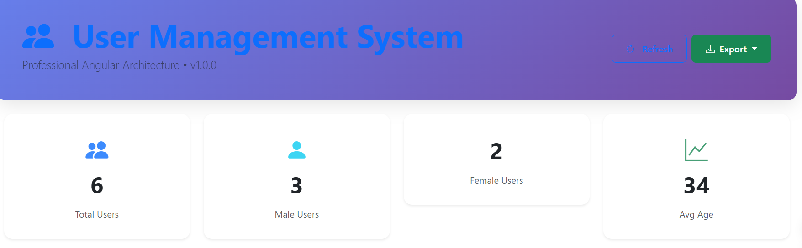
*Interface principale avec tableau de bord moderne et statistiques en temps réel*

#### 📊 Liste des utilisateurs
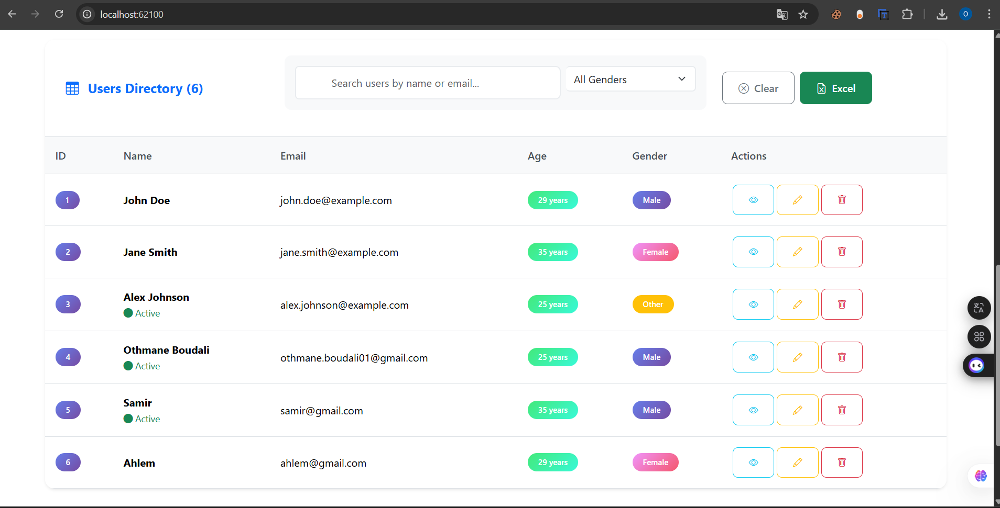
*Vue d'ensemble avec recherche avancée et actions rapides*

</div>

### 👤 Gestion des utilisateurs

<table>
<tr>
<td width="50%">

#### ➕ Ajout d'utilisateur
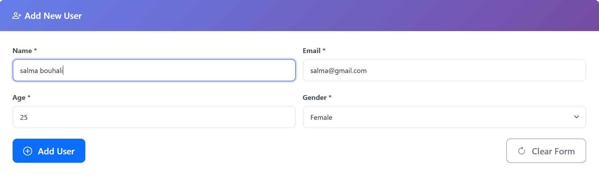
*Formulaire d'ajout avec validation temps réel*

</td>
<td width="50%">

#### 👁️ Visualisation des détails
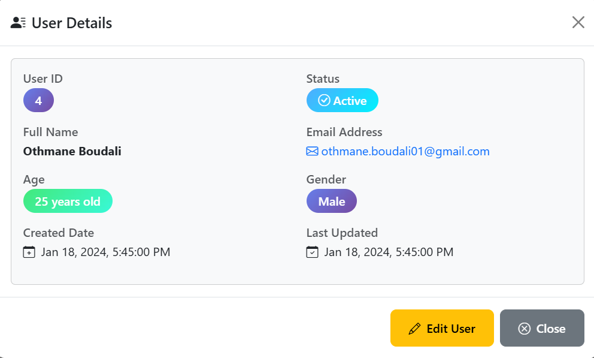
*Modal de détails utilisateur avec informations complètes*

</td>
</tr>
<tr>
<td width="50%">

#### ✏️ Édition d'utilisateur
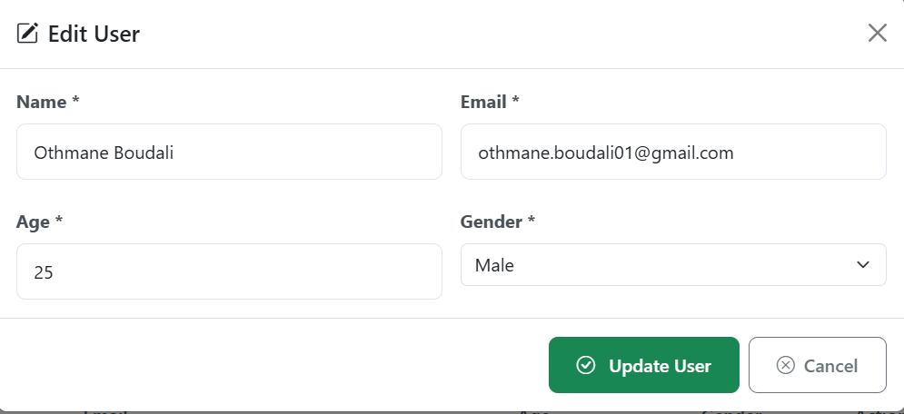
*Interface d'édition intuitive avec validation*

</td>
<td width="50%">

#### 🔍 Recherche intelligente
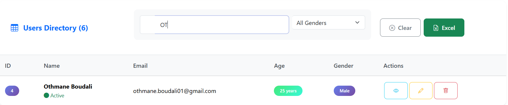
*Recherche instantanée par nom ou email*

</td>
</tr>
</table>

### 🎛️ Filtrage avancé

<div align="center">

<table>
<tr>
<td align="center" width="25%">

#### 👨 Hommes uniquement
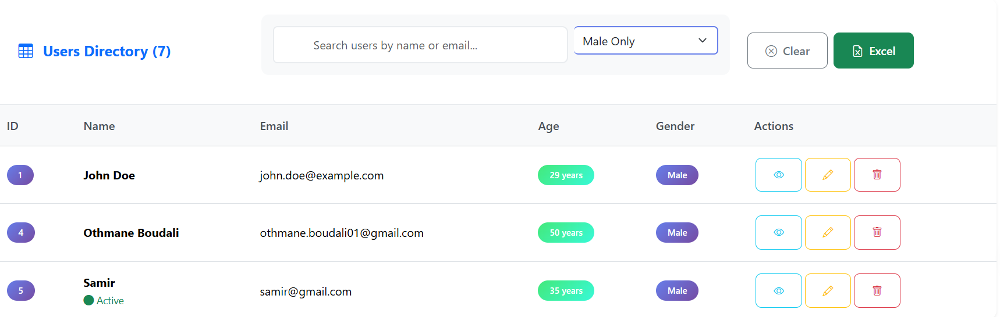
*Filtrage par genre masculin*

</td>
<td align="center" width="25%">

#### 👩 Femmes uniquement
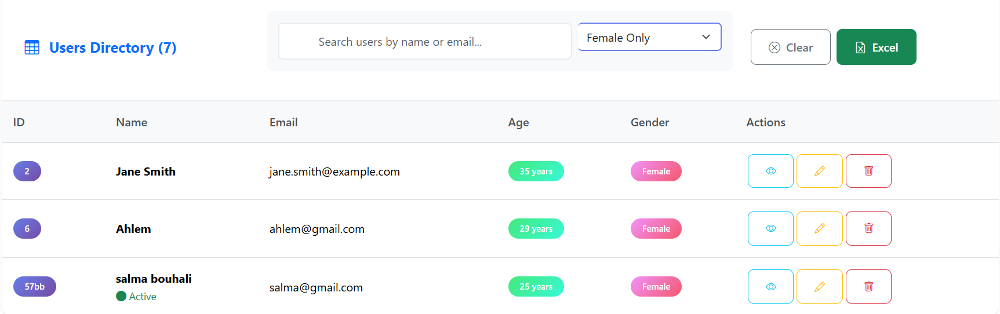
*Filtrage par genre féminin*

</td>
<td align="center" width="25%">

#### 🧑‍🤝‍🧑 Autres genres
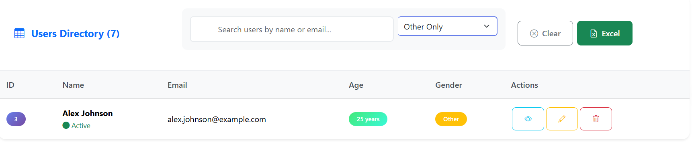
*Filtrage autres catégories*

</td>
<td align="center" width="25%">

#### 🌐 Tous genres
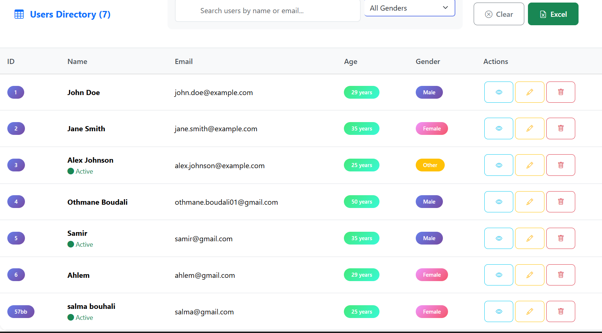
*Vue complète sans filtre*

</td>
</tr>
</table>

</div>

### 📤 Fonctionnalités d'export

<div align="center">

<table>
<tr>
<td width="50%">

#### 📋 Options d'export
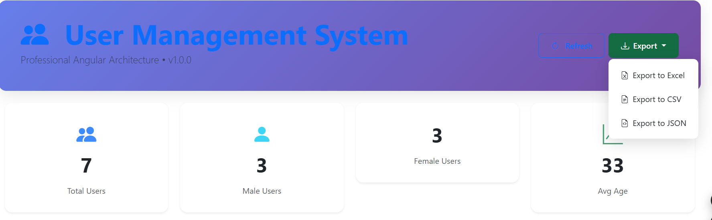
*Menu dropdown avec multiples formats d'export*

</td>
<td width="50%">

#### 📊 Export Excel
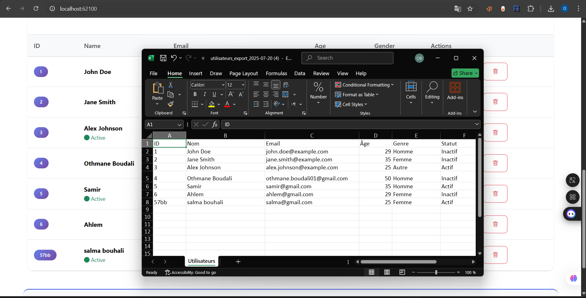
*Génération de fichier Excel professionnel*

</td>
</tr>
</table>

</div>

---
